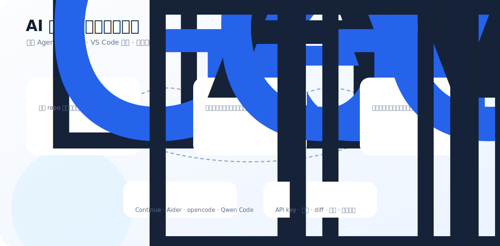

<h1 align="center">AI 编程工具中文选型指南</h1>

<p align="center">
  <strong>Codex · Claude Code · Gemini CLI · Cursor · Cline · Aider · Continue · Qwen Code · Roo Code · opencode</strong>
</p>

<p align="center">
  
</p>

> 面向学生、研究生、开发者和科研党：用中文讲清楚 2026 年主流 AI coding 工具怎么选。

最后人工核验：**2026-06-28**

> GitHub star 快照：**2026-06-28**，仅作热度参考。

如果这个项目帮你少踩一个 AI coding 工具坑，欢迎 star。后续会继续补充截图、配置模板、真实工作流和中文避坑。

## 一句话结论

- 想在终端里让 agent 改 repo：优先看 **OpenAI Codex CLI**、**Claude Code**、**Gemini CLI**、**Aider**。
- 想开箱即用 AI IDE：优先看 **Cursor**、**Windsurf**。
- 想继续用 VS Code：优先看 **Cline**、**Roo Code**、**GitHub Copilot**、**Continue**。
- 想开源可控：优先看 **Continue**、**Aider**、**Cline**、**Gemini CLI**、**Qwen Code**、**opencode**。
- 想跟中文/国产模型生态结合：关注 **Qwen Code**。

## 快速选型表

| 工具 | 类型 | 状态 | 开源 | Stars 快照 | 最适合 | 官方入口 |
| --- | --- | --- | --- | ---: | --- | --- |
| [OpenAI Codex CLI](docs/tools/openai-codex-cli.md) | `terminal-agent` | 强烈关注 | 是 | 94,122 | 喜欢在终端/本地仓库里让 agent 直接读代码、改代码、跑测试的人 | [Official](https://github.com/openai/codex) |
| [Claude Code](docs/tools/claude-code.md) | `terminal-agent` | 强烈关注 | 否 | - | 喜欢 Claude 长上下文、希望 agent 深入理解项目并执行多步任务的人 | [Official](https://docs.anthropic.com/en/docs/claude-code/overview) |
| [Gemini CLI](docs/tools/gemini-cli.md) | `terminal-agent` | 强烈关注 | 是 | 105,608 | 想试 Google Gemini 生态、偏终端和开源 agent 的用户 | [Official](https://github.com/google-gemini/gemini-cli) |
| [Cursor](docs/tools/cursor.md) | `ai-editor` | 主流 | 否 | - | 想要开箱即用 AI IDE、少折腾 CLI、重视编辑器内体验的人 | [Official](https://cursor.com/) |
| [Cline](docs/tools/cline.md) | `vscode-agent` | 热门开源 | 是 | 63,968 | 希望在 VS Code 中使用开源 agent，并连接不同模型/API 的用户 | [Official](https://github.com/cline/cline) |
| [Aider](docs/tools/aider.md) | `terminal-agent` | 经典 | 是 | 46,778 | 喜欢 Git 驱动、终端 pair programming、清晰 diff 的开发者 | [Official](https://github.com/Aider-AI/aider) |
| [Continue](docs/tools/continue.md) | `open-source-platform` | 开源平台 | 是 | 34,534 | 想搭建团队可控的开源 AI coding 平台、接入多模型的人 | [Official](https://github.com/continuedev/continue) |
| [Qwen Code](docs/tools/qwen-code.md) | `terminal-agent` | 国产模型生态 | 是 | 25,599 | 关注 Qwen/通义千问生态、中文环境和开源终端 agent 的用户 | [Official](https://github.com/QwenLM/qwen-code) |
| [Roo Code](docs/tools/roo-code.md) | `vscode-agent` | 多 agent 编辑器流 | 是 | 24,288 | 喜欢 VS Code 里多模式、多角色 agent 工作流的用户 | [Official](https://github.com/RooCodeInc/Roo-Code) |
| [opencode](docs/tools/opencode.md) | `terminal-agent` | 超高关注 | 是 | 179,952 | 想尝试高关注开源 coding agent 的用户 | [Official](https://github.com/anomalyco/opencode) |
| [GitHub Copilot](docs/tools/github-copilot.md) | `ide-assistant` | 主流基线 | 否 | - | 希望最稳定、最主流 IDE AI 补全/聊天体验的开发者和学生 | [Official](https://github.com/features/copilot) |
| [Windsurf](docs/tools/windsurf.md) | `ai-editor` | AI IDE | 否 | - | 喜欢 AI IDE 形态、希望 agent 和编辑器深度结合的用户 | [Official](https://windsurf.com/) |

## 按人群推荐

### 学生党 / 课程作业

```text
GitHub Copilot + Cursor / VS Code + Cline
```

重点是少折腾、能快速完成课程项目，同时不要把 API key 和成本管理搞崩。

### 研究生 / 科研代码

```text
Codex CLI / Claude Code / Aider + Git + pytest
```

重点是让 agent 读懂 repo、改实验脚本、跑测试、写 README 和复现实验说明。

### 开源项目维护者

```text
Codex CLI + Continue / Cline + CI
```

重点是 issue triage、PR 小修、文档更新、测试补齐和 release notes。

### 想自建/可控

```text
Continue + Aider + Qwen Code / Gemini CLI
```

重点是模型可换、配置可控、成本透明。

## 选择 AI coding 工具时最重要的 8 个问题

1. 你想在 IDE 里用，还是终端里用？
2. 你需要自动改代码，还是只要补全/聊天？
3. 你能接受闭源商业产品吗？
4. 你愿意管理 API key 和 token 成本吗？
5. 你是否需要中文模型或国内模型生态？
6. 你是否需要读整个 repo、跑测试、改多文件？
7. 你能否接受 agent 直接操作本地文件？
8. 团队是否需要统一配置、审计和权限边界？

## 安全与成本底线

- 不要把生产密钥、云账号、支付 key 暴露给 agent。
- 大仓库自动修改前先开分支，保留 git diff。
- 开启自动命令执行前，先理解工具的权限模型。
- API key 模式一定要设预算、限额和日志。
- 不要迷信 star 排名，最终要看你的项目类型和工作流。

## 数据维护

结构化数据在 [`data/tools.json`](data/tools.json)。

重新生成：

```bash
python3 scripts/generate.py
```

## 贡献方式

欢迎 PR 补充：

- 新 AI coding 工具
- 中文使用体验
- 官方文档链接
- 价格/学生计划变化
- 安全和成本避坑
- 真实截图或原创信息图

请不要提交：

- 返利链接
- 未经授权搬运的付费教程截图
- 夸大工具能力的营销文案
- 无法验证的价格和额度

## Disclaimer

本项目是公开信息整理，不代表任何工具官方。模型、额度、价格、账号限制和产品能力变化很快，请以官方页面为准。

## License

MIT.
